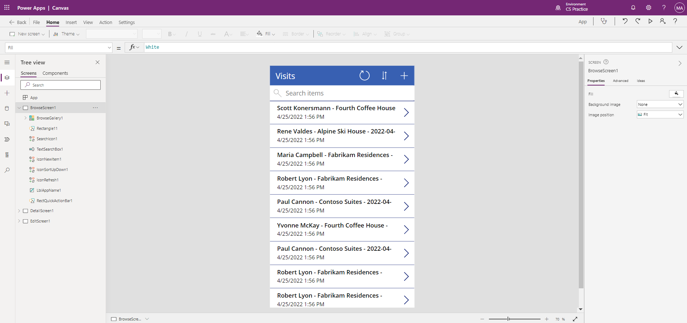

---
lab:
  title: ラボ 2:キャンバス アプリをビルドする方法
  module: 'Module 3: Get started with Power Apps'
ms.openlocfilehash: 24d99d14079d40f74a43ed0de64dd6ae5d7046c7
ms.sourcegitcommit: 0118c25a230425d0ccba16e6c3922053ee07c183
ms.translationtype: HT
ms.contentlocale: ja-JP
ms.lasthandoff: 05/06/2022
ms.locfileid: "144810922"
---
# モジュール 3:Power Apps の概要
## ラボ:キャンバス アプリをビルドする方法

# シナリオ

ベローズ カレッジは、キャンパス内に複数の建物を持つ教育機関です。 キャンパス訪問は現在、紙の記録簿に記録されています。 その情報は一貫して把握されておらず、キャンパス全体の訪問に関するデータを収集して分析する手段もありません。

現在、キャンパス管理では、Excel スプレッドシートを利用して訪問者の登録を追跡しています。 現在の訪問者登録システムでは、建物へのアクセスがセキュリティ担当者によって管理されており、すべての訪問を訪問先で事前に登録し、記録する必要があるため、カレッジではこのシステムを最新化したいと考えています。

このコース全体を通して、アプリケーションを構築するとともに自動化を行って、ベローズ カレッジの管理担当者とセキュリティ担当者がキャンパス内の建物へのアクセスを管理および制御できるようにします。

# ラボ手順の概要

キャンバス アプリを設計するには、以下の概要に従います。

-   訪問テーブルのデータからキャンバス アプリを作成する

-   訪問を参照画面に表示する方法を構成する

-   アプリにいくつかの基本的な変更を加える

-   アプリの機能をテストする

## 前提条件

-   **モジュール 0 ラボ 0 - ラボ環境の検証** の完了

# 演習 \#1:訪問アプリを作成する

**目的:** この演習では、以前に作成した訪問の初期値テーブルを接続して、キャンバス アプリを作成します。

## タスク \#1:訪問アプリを作成する

1.  <https://make.powerapps.com> に移動します。 再認証が必要な場合は、「**サインイン**」をクリックし、必要に応じて指示に従ってください。

2.  **[[自分のイニシャル] 練習]** 環境がまだ選択されていない場合は、右上で選択します。

3.  必要に応じて、画面の左側にある **[ホーム]** アイコンをクリックします。 **[開始]** セクションで、 **[Dataverse]** を選択します。

4.  Dataverse 接続を選択します。 

    >   **注:** *"Dataverse 接続が存在しない場合:"*
    >   -   **[新しい接続]** を選択します
    >   -   **[Microsoft Dataverse]** を見つけます
    >   -   **[作成]**

5.  前のラボで作成した **[訪問]** テーブルを見つけて選択します。

6.  右下隅にある **[接続]** ボタンを選びます。

7.  アプリが作成されたら、[Power Apps Studio へようこそ] 画面で、 **[今後は表示しない]** ボックスをオンにし、 **[スキップ]** を選択します。

8.  作成が完了したら、次の図のような画面が表示されます。

9. アプリ デザイナーのコマンド バーで、 **[アプリのプレビュー]** を選択します *"(キーボードの F5 キーを押してアプリをプレビューすることもできます)。"* 使ってみて、アプリがすぐに使用できる状態であることを確認します。

10. 画面の右上にある **X** を選択して、アプリのプレビューを閉じます。

これで、Dataverse テーブルから Power App が正常に作成されました。 プロセスの次のステップとして、カレッジのブランド化に合わせてアプリを調整します。 次の一連の手順では、いくつかの点でアプリをさらにカスタマイズする手順について説明します。

## タスク \#2:新しく作成したアプリのテーマを変更する

このタスクでは、アプリの 3 つの各画面 ([参照]、[詳細]、[編集]) のヘッダー テキストをカスタマイズし、アプリ テーマを変更します。

1.  [参照] 画面が表示されます。 画面上の **[訪問]** ラベルを選びます。

3.  画面の右側にある [プロパティ] タブで、 **[テキスト]** コントロール プロパティを「**ベローズ カレッジの訪問**」に更新します。

4. [プロパティ] で、 **[フォント サイズ]** を **[24]** に変更します。

4.  空白の背景をクリックすると、[参照] 画面に更新されたテキストが表示されます。

5.  左側のナビゲーションを使用して、 **[詳細画面 1]** を選択します。

5.  画面上の **[訪問]** ラベルを選びます。

6.  画面の右側にある [プロパティ] タブで、 **[テキスト]** コントロール プロパティを「**訪問の詳細**」に更新します。

7.  空白の背景をクリックすると、[詳細] 画面に更新されたテキストが表示されます。

8.  左側のナビゲーションを使って、 **[詳細画面 1]** を選びます (ツリー ビューでこれを表示するには、必要に応じて下にスクロールします)。

9.  画面上の **[訪問]** ラベルを選びます。

10.  画面の右側にある [プロパティ] タブで、 **[テキスト]** コントロール プロパティのテキスト [テーブル 1] を「**詳細の編集**」に置き換えます。

11.  空白の背景をクリックすると、[編集] 画面に更新されたテキストが表示されます。

12. 左側のナビゲーションを使用して、 **[参照画面 1]** を選択します。

13. コマンド ツール バーで、 **[テーマ]** ボタンを選択し、表示された一覧で、テーマの色として **[赤]** を選択します。

## タスク \#3:訪問アプリをテストする

このタスクでは、新しいアプリをテストします。

1.  アプリ デザイナーでアプリケーションを開いた状態で、 **[ファイル]** を選択し、アプリの名前を「**訪問アプリ**」に更新して、 **[保存]** を選択します。

2.  **戻る** 矢印を選んでアプリに戻ります。

3.  左側のナビゲーションを使用して、 **[参照画面 1]** を選択します。

4.  アプリ デザイナーのコマンド バーで、 **[アプリのプレビュー]** を選択します *"(キーボードの F5 キーを押してアプリをプレビューすることもできます)。"*

4.  アプリが開いたら、 **[検索]** フィールドに、テキスト「**Maria**」と入力します 
     *"(検索フィールドに入力された内容に基づいて、ギャラリー内の項目がどのようにフィルター処理されるかに注意してください)。"*

5.  **Maria Campbell** の **Contoso Suites** レコードが表示され、行をクリックして移動すると、その訪問の詳細が表示されます。 (**注**: *"Maria Campbell の Contoso Suites レコードが複数表示される場合、いずれかを選択します")。*

6.  レコードを編集するには、アプリの右上隅にある **鉛筆アイコン** を選択します。

7.  ここで [Visit Name]\(訪問名\) を編集することができます。右上隅のチェックマーク アイコンをクリックすると、変更を保存することができます。

8.  画面の右上隅にある **X** アイコンをクリックすると、キャンバス アプリ エディターに戻ります。

お疲れさまでした。 最初のキャンバス アプリの作成と構成が完了しました。

# 課題

-   [詳細画面 1] と [編集画面 1] のフォームに列 [実際の開始]、[実際の終了]、[コード]、[開始予定]、[終了予定] を追加してみましょう
